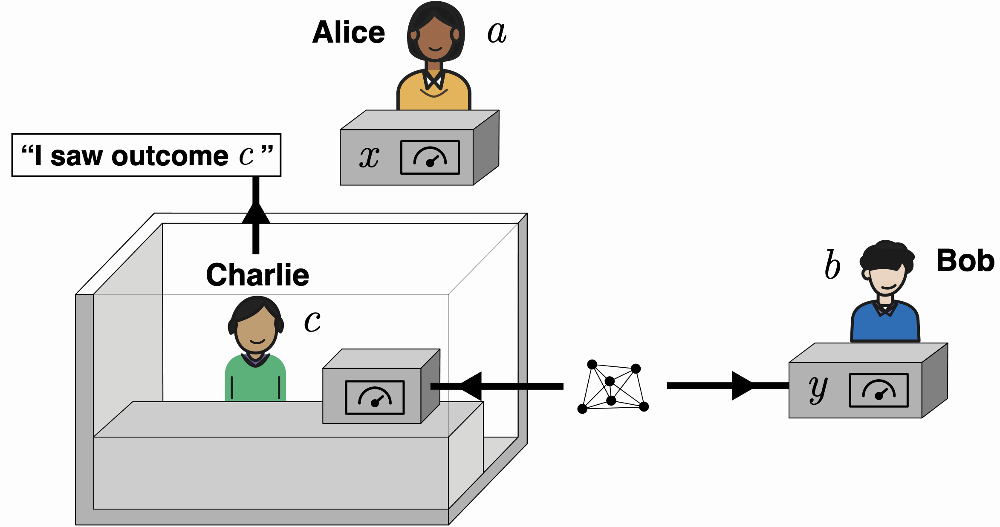

# Extended Wigner's Friend Scenarios with Agent-Like Observers on Quantum Computers

Joshua Laux and A/Prof. Eric G. Cavalcanti  

  

## Master's thesis

[Read Joshua Laux's thesis in the ETH Research Collection](https://doi.org/10.3929/ethz-c-000805819)

Supervised by Prof. Renato Renner

## Research paper

[Read the preprint on arXiv](https://arxiv.org/abs/2609.12527)

## Code

[View the thesis repository on GitHub](https://github.com/lauxj/agent-like-observers-ewfs)

## Contact
## Contact
lauxj@ethz.ch
[LinkedIn](https://www.linkedin.com/in/joshua-laux-37a549274)

